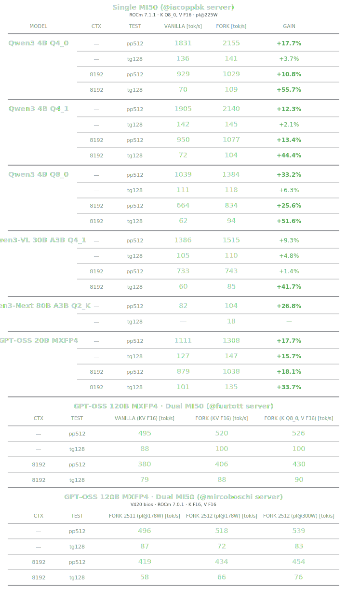
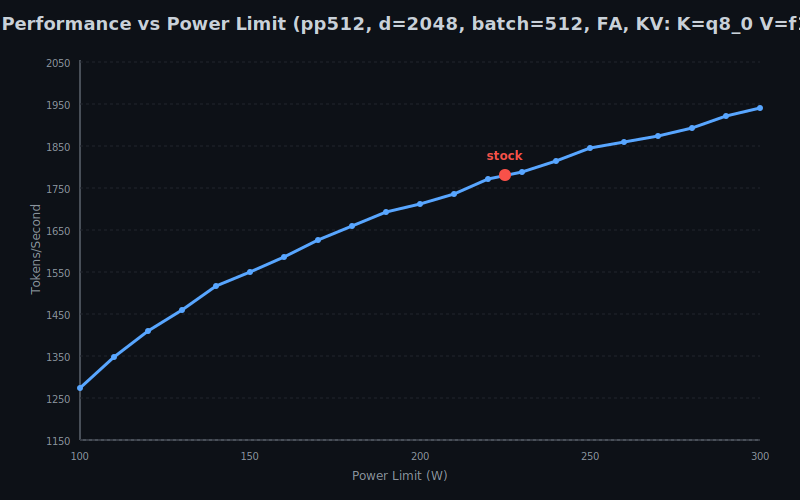
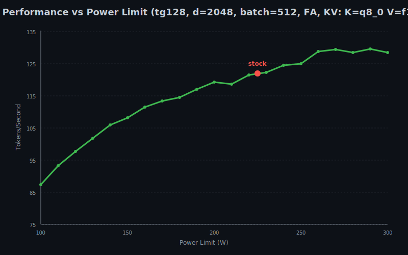

# llama.cpp-gfx906-2511

High-performance llama.cpp fork optimized for AMD Radeon Vega 7nm (MI50/MI60) GPUs. Features DPP-accelerated reductions, vectorized quantization kernels, and Q8-optimized flash attention delivering up to 18% faster inference on GFX906 architecture. Based on llama.cpp build 7127.


## Benchmark Results




## What Changed

```
common.cuh           DPP-based warp reductions with unified shuffle XOR dispatch
fattn-common.cuh     GCN-optimized thread counts and tile configurations
fattn.cu             Q8-optimized tile kernel selection for GFX906 flash attention
mmq.cu               Integrated GFX906 vectorized loads for Q4_0/Q4_1 quantizations
gfx906/              New directory with MI50/MI60-specific kernel implementations
```

## Compile-Time Configuration

```cpp
// Disable Split-K for GFX906
#define GFX906_FATTN_SPLIT_K_ENABLED 0

// Enable Q8 quantized flash attention
#define GFX906_FATTN_Q8_ENABLED 1

// Enable DPP-based warp reductions
#define GFX906_USE_DPP_REDUCTIONS 1
```


## Quick Start

```bash
git clone https://github.com/iacopPBK/llama.cpp-gfx906.git
cd llama.cpp-gfx906
./SCRIPT_compile_MI50.sh      # edit ROCM_PATH if not using /opt/rocm
./SCRIPT_launch_server_MI50.sh # edit MODEL_PATH to your model file
```

Tested with ROCm nightly build and GFX906 GPU (MI50/MI60).


## Power Scaling

Performance scales with power limit using [SCRIPT_overclock_upp_MI50.sh](https://github.com/sibradzic/upp) for MI50 overclocking via UPP (Powerplay Table Editor).






## Links

[AMD GCN ISA](https://gpuopen.com/learn/amdgcn-assembly/) ・ [llama.cpp](https://github.com/ggml-org/llama.cpp) ・ [ROCm](https://rocm.docs.amd.com/) ・ [GFX906 Discord](https://discord.gg/ZEcgt3dAw) ・ [wiki-gfx906](https://github.com/skyne98/wiki-gfx906) ・ [llama-labs-gfx906](https://github.com/skyne98/llama-labs-gfx906)


<sub>Built for the GFX906 community</sub>
